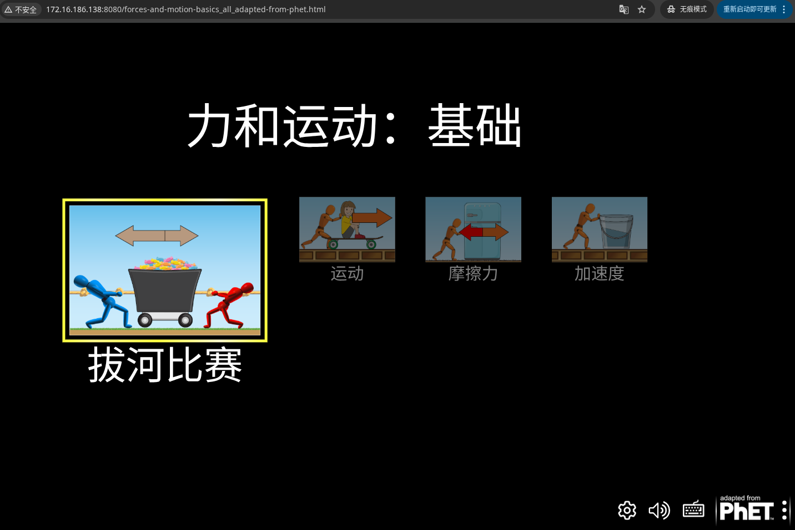
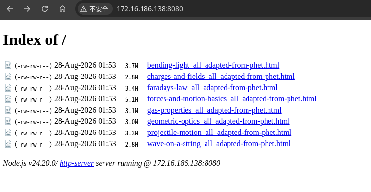
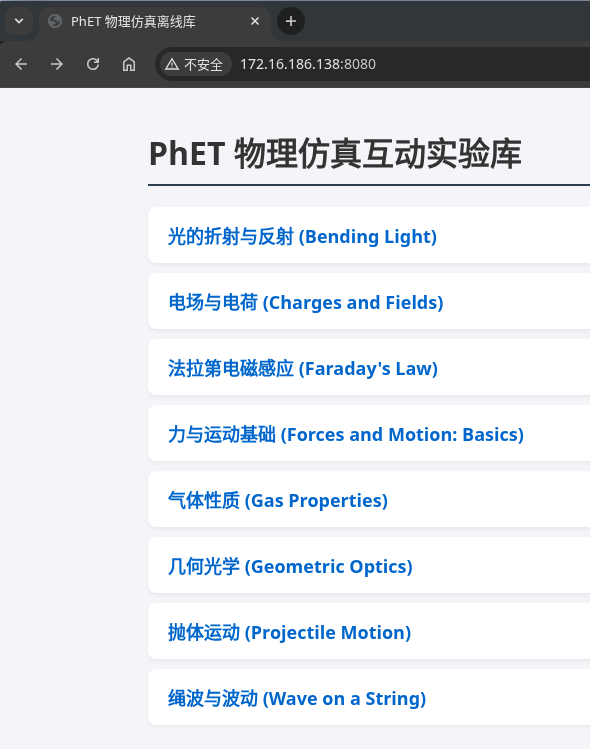
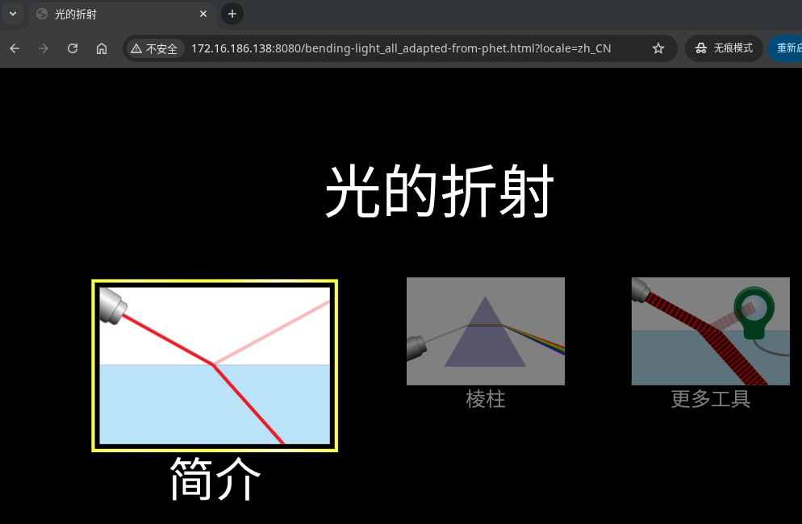

# 前奏
```shell
基本配置:
CPU:     4 vCPU
RAM:     8 GB
Disk:    100 GB SSD
Network: NAT/Bridged 都可以
 
如果目标真的是把全部 HTML5 PhET 模拟器源码都 checkout/build 则建议:
CPU:     6-8 vCPU
RAM:     16 GB
Disk:    200 GB SSD
 
原因不是运行模拟器需要这么高配置, 而是源码仓库 + npm 依赖 + build 临时文件 + 多个模拟器同时构建会吃磁盘和内存.
 
 
 
 
rambo@ub2404:~$ cat /etc/apt/sources.list.d/ubuntu.sources
Types: deb
URIs: http://hk.archive.ubuntu.com/ubuntu/
Suites: noble noble-updates noble-backports
Components: main restricted universe multiverse
Signed-By: /usr/share/keyrings/ubuntu-archive-keyring.gpg
 
Types: deb
URIs: http://security.ubuntu.com/ubuntu/
Suites: noble-security
Components: main restricted universe multiverse
Signed-By: /usr/share/keyrings/ubuntu-archive-keyring.gpg
 
 
rambo@ub2404:~$ sudo apt update && sudo apt install -y vim wget curl net-tools git build-essential


```


# 安装npm
```shell
rambo@ub2404:~$ curl -fsSL https://raw.githubusercontent.com/nvm-sh/nvm/master/install.sh | bash
rambo@ub2404:~$ 
export NVM_DIR="$HOME/.nvm"
[ -s "$NVM_DIR/nvm.sh" ] && \. "$NVM_DIR/nvm.sh"  # This loads nvm
[ -s "$NVM_DIR/bash_completion" ] && \. "$NVM_DIR/bash_completion"
 
source ~/.bashrc
nvm install --lts
nvm use --lts
 
rambo@ub2404:~$ for i in node npm;do $i -v;done
v24.20.0
11.19.0

 
# 全局安装 PhET 构建依赖工具
rambo@ub2404:~$ npm install -g grunt-cli tsx http-server
 

```


# 初始化工作区与 Git 环境
```shell
创建工作区目录，并配置全局 Git 身份及根目录存根（防止打包元数据提取失败）：
# 1. 创建并进入主工作区
rambo@ub2404:~$ mkdir -p ~/phetsims && cd ~/phetsims

# 2. 配置 Git 全局身份
git config --global user.email "rambo@ub2404.local"
git config --global user.name "rambo"

# 3. 初始化根目录存根并提交初始 Commit（供 perennial 提取元数据）
git init
echo "*" > .gitignore
git add -f .gitignore
git commit -m "chore: workspace root git stub"


```


# 批量拉取官方核心依赖与目标仿真仓库
```shell
rambo@ub2404:~/phetsims$ git clone https://github.com/phetsims/perennial.git
rambo@ub2404:~/phetsims$ cd perennial
rambo@ub2404:~/phetsims$ npm install


rambo@ub2404:~/phetsims/perennial$ ls -alh node_modules/.bin/grunt
lrwxrwxrwx 1 rambo rambo 18 Aug 27 18:42 node_modules/.bin/grunt -> ../grunt/bin/grunt
 
如果存在就执行:
rambo@ub2404:~/phetsims$ ./perennial/node_modules/.bin/grunt --version
grunt-cli v1.4.3
(node:4548) [DEP0187] DeprecationWarning: Passing invalid argument types to fs.existsSync is deprecated
(Use `node --trace-deprecation ...` to show where the warning was created)


# 手动克隆目标项目
rambo@ub2404:~/phetsims$ for repo in forces-and-motion-basics chipper scenery axon phet-core tandem sun joist brand dot kite utterance-queue query-string-machine sherpa bamboo scenery-phet mobius babel assert twixt tambo phetcommon; do
  if [ ! -d "$repo" ]; then
    git clone https://github.com/phetsims/$repo.git
  fi
done


# 建立关键链接与 TypeScript 代码转译
修补历史依赖别名路径，并安装核心构建器依赖，将所有 TypeScript 代码转译为原生 JS 开发产物：
# 建立 perennial 别名软链接
rambo@ub2404:~/phetsims$ [ ! -L "perennial-alias" ] && ln -s perennial perennial-alias

# 2. 安装 chipper 构建引擎依赖
rambo@ub2404:~/phetsims$ cd chipper
rambo@ub2404:~/phetsims/chipper$ npm install

# 3. 全量转译所有仓库的 TypeScript 代码到 dist 目录
rambo@ub2404:~/phetsims/chipper$ npx grunt transpile


```


# 生成独立的离线单文件html包
```shell
以主项目 forces-and-motion-basics 为例进行打包（如需全量打包，对其他项目重复此步即可）：
# 进入目标仿真项目目录并安装依赖
rambo@ub2404:~/phetsims/chipper$ cd ../forces-and-motion-basics/
rambo@ub2404:~/phetsims/forces-and-motion-basics$ npm install

# 建立配置文件软链接（避免lint告警提示）
# 补全 build-local.json 品牌配置
rambo@ub2404:~/phetsims/forces-and-motion-basics$ cd ..
rambo@ub2404:~/phetsims$ cat << 'EOF' > build-local.json
{
  "brand": "phet",
  "brands": [ "phet", "adapted-from-phet" ]
}
EOF


rambo@ub2404:~/phetsims$ cd forces-and-motion-basics/
rambo@ub2404:~/phetsims/forces-and-motion-basics$ ln -s ../build-local.json build-local.json


# 执行生产打包任务
rambo@ub2404:~/phetsims/forces-and-motion-basics$ npx grunt build
(node:5045) [DEP0187] DeprecationWarning: Passing invalid argument types to fs.existsSync is deprecated
(Use `node --trace-deprecation ...` to show where the warning was created)
Running "build" task
warn: Missing or incorrect build-local.json!
skipping type checking
>> Type Check complete:			0ms
>> Transpile complete:			5661ms
Building runnable repository (forces-and-motion-basics, brands: adapted-from-phet)
Building brand: adapted-from-phet
>> Webpack build complete:		9619ms
>> Production minify complete:		30293ms (4807779 bytes)
>> Debug minify complete:		0ms (30847714 bytes)
>> Brand adapted-from-phet complete:	52302ms


rambo@ub2404:~/phetsims/forces-and-motion-basics$ ls -alh build/
total 12K
drwxrwxr-x  3 rambo rambo 4.0K Aug 28 01:09 .
drwxrwxr-x 10 rambo rambo 4.0K Aug 28 01:09 ..
drwxrwxr-x  3 rambo rambo 4.0K Aug 28 01:09 adapted-from-phet
rambo@ub2404:~/phetsims/forces-and-motion-basics$ ls -alh build/adapted-from-phet/
total 52M
drwxrwxr-x 3 rambo rambo 4.0K Aug 28 01:09 .
drwxrwxr-x 3 rambo rambo 4.0K Aug 28 01:09 ..
-rw-rw-r-- 1 rambo rambo  731 Aug 28 01:09 buildInfo.json
-rw-rw-r-- 1 rambo rambo  210 Aug 28 01:09 dependencies.json
-rw-rw-r-- 1 rambo rambo  51K Aug 28 01:09 english-string-map.json
-rw-rw-r-- 1 rambo rambo 8.7K Aug 28 01:09 forces-and-motion-basics-128.png
-rw-rw-r-- 1 rambo rambo 113K Aug 28 01:09 forces-and-motion-basics-600.png
-rw-rw-r-- 1 rambo rambo  35M Aug 28 01:09 forces-and-motion-basics_all_adapted-from-phet_debug.html
-rw-rw-r-- 1 rambo rambo 5.1M Aug 28 01:09 forces-and-motion-basics_all_adapted-from-phet.html
-rw-rw-r-- 1 rambo rambo 2.4M Aug 28 01:09 forces-and-motion-basics_all_adapted-from-phet.html.gz
-rw-rw-r-- 1 rambo rambo 4.8M Aug 28 01:09 forces-and-motion-basics_en_adapted-from-phet.html
-rw-rw-r-- 1 rambo rambo 5.0M Aug 28 01:09 string-map.json
drwxrwxr-x 2 rambo rambo 4.0K Aug 28 01:09 xhtml


# 创建 phet-io 目录结构
rambo@ub2404:~/phetsims/forces-and-motion-basics$ mkdir -p ~/phetsims/phet-io/js
# 建立 phetioEngine.js 伪装模块
rambo@ub2404:~/phetsims/forces-and-motion-basics$ cat << 'EOF' > ~/phetsims/phet-io/js/phetioEngine.js
export default {};
export class PhetioEngine {}
EOF
# 建立 package.json 伪装说明
rambo@ub2404:~/phetsims/forces-and-motion-basics$ cat << 'EOF' > ~/phetsims/phet-io/package.json
{
  "name": "phet-io",
  "version": "1.0.0"
}
EOF


使用 adapted-from-phet 品牌
对于开源构建（非 PhET 官方内部分发），必须使用开源品牌 adapted-from-phet。这不仅是官方架构的设计逻辑，也能完全避开私有闭源模块的依赖
rambo@ub2404:~/phetsims/forces-and-motion-basics$ npx grunt build --brands=adapted-from-phet
(node:5545) [DEP0187] DeprecationWarning: Passing invalid argument types to fs.existsSync is deprecated
(Use `node --trace-deprecation ...` to show where the warning was created)
Running "build" task
warn: Missing or incorrect build-local.json!
skipping type checking
>> Type Check complete:			0ms
>> Transpile complete:			4402ms
Building runnable repository (forces-and-motion-basics, brands: adapted-from-phet)
Building brand: adapted-from-phet
>> Webpack build complete:		8078ms
>> Production minify complete:		26737ms (4807779 bytes)
>> Debug minify complete:		0ms (30847714 bytes)
>> Brand adapted-from-phet complete:	45149ms
释义：
PhET 源码中仅合法支持以下四种品牌名称：
phet：PhET 官方品牌（包含官方 Logo 和版权信息）。
adapted-from-phet：开源改编品牌（默认值，包含 "Adapted from PhET" 标识）
phet-io：针对机构企业增强的交互数据 API 版本
phet-io-sim-specific：特定仿真项目的 phet-io 扩展版


# 检查生成的离线单文件
rambo@ub2404:~/phetsims/forces-and-motion-basics$ ls -lh build/adapted-from-phet/forces-and-motion-basics_all_adapted-from-phet.html
-rw-rw-r-- 1 rambo rambo 5.1M Aug 28 01:20 build/adapted-from-phet/forces-and-motion-basics_all_adapted-from-phet.html


# 启动本地轻量服务进行预览
在当前目录下直接用 http-server 启动服务：
rambo@ub2404:~/phetsims/forces-and-motion-basics$ npx http-server build/adapted-from-phet -p 8080 -o forces-and-motion-basics_all_adapted-from-phet.html     # 以下是回显
Starting up http-server, serving build/adapted-from-phet

http-server version: 14.1.1

http-server settings: 
CORS: disabled
Cache: 3600 seconds
Connection Timeout: 120 seconds
Directory Listings: visible
AutoIndex: visible
Serve GZIP Files: false
Serve Brotli Files: false
Default File Extension: none

Available on:
  http://127.0.0.1:8080
  http://172.16.186.138:8080
Hit CTRL-C to stop the server
Open: http://127.0.0.1:8080/forces-and-motion-basics_all_adapted-from-phet.html


启动后用浏览器访问 http://<虚拟机IP>:8080 即可正常使用


# 创建导出文件夹
rambo@ub2404:~/phetsims/forces-and-motion-basics$ mkdir -p ~/phet-offline-dist

# 复制生成的 HTML
rambo@ub2404:~/phetsims/forces-and-motion-basics$ cp build/adapted-from-phet/forces-and-motion-basics_all_adapted-from-phet.html  ~/phet-offline-dist/
注：
这一个文件就包含了所有的物理逻辑、动画和多语言资源，脱网环境下直接双击用浏览器打开就能玩


ctrl+c取消掉上述的本地轻量服务进行预览


# 启动 HTTP 预览服务，将服务根目录挂载到 ~/phet-offline-dist（推荐）：
rambo@ub2404:~/phetsims/forces-and-motion-basics$ npx http-server ~/phet-offline-dist -p 8080 -o forces-and-motion-basics_all_adapted-from-phet.html
Starting up http-server, serving /home/rambo/phet-offline-dist

http-server version: 14.1.1

http-server settings: 
CORS: disabled
Cache: 3600 seconds
Connection Timeout: 120 seconds
Directory Listings: visible
AutoIndex: visible
Serve GZIP Files: false
Serve Brotli Files: false
Default File Extension: none

Available on:
  http://127.0.0.1:8080
  http://172.16.186.138:8080
Hit CTRL-C to stop the server
Open: http://127.0.0.1:8080/forces-and-motion-basics_all_adapted-from-phet.html


浏览器访问：http://172.16.186.138:8080/forces-and-motion-basics_all_adapted-from-phet.html


因为你刚才编译和打开的一直都是 forces-and-motion-basics 这一个软件，它本身就只设计了这 4 个子模块
PhET 的架构是一个物理软件对应一个独立仓库，编译出来就是一个独立的 HTML 文件。你不可能在一个 .html 里看到全部物理知识点
你要获取电学、光学、热学等其他知识点，必须把其他项目的仓库也分别编译成单独的 HTML


```



# 批量编译其他物理知识点
```shell
rambo@ub2404:~/phetsims/forces-and-motion-basics$ cd ..
rambo@ub2404:~/phetsims$ vim 1.sh
cd ~/phetsims

# 1. 定义其他物理项目列表
repos=(
  "energy-skate-park-basics"    # 能量守恒
  "projectile-motion"           # 抛体运动
  "balancing-act"               # 杠杆平衡
  "circuit-construction-kit-dc" # 直流电路
  "charges-and-fields"          # 电场与电荷
  "faradays-law"                # 电磁感应
  "wave-on-a-string"            # 绳波/波动
  "bending-light"               # 光的折射与反射
  "geometric-optics"            # 透镜成像
  "gas-properties"              # 气体性质
)

# 2. 批量克隆、安装依赖并编译
for repo in "${repos[@]}"; do
  if [ ! -d "$repo" ]; then
    git clone "https://github.com/phetsims/${repo}.git"
  fi
  
  echo ">>> 正在编译: $repo"
  cd "$repo"
  npm install --silent
  npx grunt build --brands=adapted-from-phet
  cd ~/phetsims
done

# 3. 把所有编译好的 HTML 统一提取到导出目录
find ~/phetsims -maxdepth 4 -path "*/build/adapted-from-phet/*_all_adapted-from-phet.html" -exec cp {} ~/phet-offline-dist/ \;

# 4. 查看编译出来的全量 HTML 清单
ls -lh ~/phet-offline-dist/


rambo@ub2404:~/phetsims$ bash 1.sh 
....
  ....            # 以下执行脚本的最后回显
Building runnable repository (gas-properties, brands: adapted-from-phet)
Building brand: adapted-from-phet
>> Webpack build complete:		7538ms
>> Production minify complete:		24557ms (2634449 bytes)
>> Debug minify complete:		0ms (26280119 bytes)
>> Brand adapted-from-phet complete:	40734ms
total 28M
-rw-rw-r-- 1 rambo rambo 3.8M Aug 28 01:45 bending-light_all_adapted-from-phet.html
-rw-rw-r-- 1 rambo rambo 2.9M Aug 28 01:45 charges-and-fields_all_adapted-from-phet.html
-rw-rw-r-- 1 rambo rambo 3.5M Aug 28 01:45 faradays-law_all_adapted-from-phet.html
-rw-rw-r-- 1 rambo rambo 5.1M Aug 28 01:45 forces-and-motion-basics_all_adapted-from-phet.html
-rw-rw-r-- 1 rambo rambo 3.1M Aug 28 01:45 gas-properties_all_adapted-from-phet.html
-rw-rw-r-- 1 rambo rambo 3.1M Aug 28 01:45 geometric-optics_all_adapted-from-phet.html
-rw-rw-r-- 1 rambo rambo 3.4M Aug 28 01:45 projectile-motion_all_adapted-from-phet.html
-rw-rw-r-- 1 rambo rambo 2.9M Aug 28 01:45 wave-on-a-string_all_adapted-from-phet.html


# 清空现有的离线目录
rambo@ub2404:~/phetsims$ rm -rf ~/phet-offline-dist/*

# 重新从各个项目的 build 目录中提取最终的单文件 HTML
rambo@ub2404:~/phetsims$ find ~/phetsims -maxdepth 4 -path "*/build/adapted-from-phet/*_all_adapted-from-phet.html" -exec cp {} ~/phet-offline-dist/ \;

# 查看提取后的离线文件清单
rambo@ub2404:~/phetsims$ ls -alh ~/phet-offline-dist/
total 28M
drwxrwxr-x  2 rambo rambo 4.0K Aug 28 01:53 .
drwxr-x--- 19 rambo rambo 4.0K Aug 28 01:30 ..
-rw-rw-r--  1 rambo rambo 3.8M Aug 28 01:53 bending-light_all_adapted-from-phet.html
-rw-rw-r--  1 rambo rambo 2.9M Aug 28 01:53 charges-and-fields_all_adapted-from-phet.html
-rw-rw-r--  1 rambo rambo 3.5M Aug 28 01:53 faradays-law_all_adapted-from-phet.html
-rw-rw-r--  1 rambo rambo 5.1M Aug 28 01:53 forces-and-motion-basics_all_adapted-from-phet.html
-rw-rw-r--  1 rambo rambo 3.1M Aug 28 01:53 gas-properties_all_adapted-from-phet.html
-rw-rw-r--  1 rambo rambo 3.1M Aug 28 01:53 geometric-optics_all_adapted-from-phet.html
-rw-rw-r--  1 rambo rambo 3.4M Aug 28 01:53 projectile-motion_all_adapted-from-phet.html
-rw-rw-r--  1 rambo rambo 2.9M Aug 28 01:53 wave-on-a-string_all_adapted-from-phet.html


# 启动全量目录托管服务
在终端运行以下命令（注意路径是 ~/phet-offline-dist 目录，不接具体文件名）：
rambo@ub2404:~/phetsims$ npx http-server ~/phet-offline-dist -p 8080
Starting up http-server, serving /home/rambo/phet-offline-dist

http-server version: 14.1.1

http-server settings: 
CORS: disabled
Cache: 3600 seconds
Connection Timeout: 120 seconds
Directory Listings: visible
AutoIndex: visible
Serve GZIP Files: false
Serve Brotli Files: false
Default File Extension: none

Available on:
  http://127.0.0.1:8080
  http://172.16.186.138:8080
Hit CTRL-C to stop the server


在浏览器中访问与导航打开浏览器，在地址栏输入：http://172.16.186.138:8080页面会直接列出刚才编译出的所有物理模块：
HTML文件名                                     对应物理知识点
bending-light_...html                       光的折射与反射（斯奈尔定律、全反射、色散）
charges-and-fields_...html                  静电场与电荷（库仑定律、电场线、等势面）
faradays-law_...html                        法拉第电磁感应（磁通量、楞次定律）
forces-and-motion-basics_...html            力与运动基础（牛顿第一/二定律、摩擦力）
gas-properties_...html                      气体性质（理想气体状态方程 $PV=nRT$）
geometric-optics_...html                    几何光学（凸透镜与凹透镜成像规律）
projectile-motion_...html                   抛体运动（平抛/斜抛、初速度、阻力与射程）
wave-on-a-string_...html                    机械波（波速、频率、波长、干涉与反射）


```



# 在本地生成 index.html 导航首页
```shell
在 ~/phet-offline-dist 目录下创建一个简单的首页，方便线上访问：
rambo@ub2404:~/phetsims$ cd ../phet-offline-dist/
rambo@ub2404:~/phet-offline-dist$ cat << 'EOF' > index.html
<!DOCTYPE html>
<html lang="zh-CN">
<head>
  <meta charset="UTF-8">
  <title>PhET 物理仿真离线库</title>
  <style>
    body { font-family: system-ui, sans-serif; max-width: 800px; margin: 40px auto; padding: 0 20px; background: #f4f4f9; color: #333; }
    h1 { border-bottom: 2px solid #2c3e50; padding-bottom: 10px; }
    ul { list-style: none; padding: 0; }
    li { background: #fff; margin: 10px 0; padding: 15px 20px; border-radius: 8px; box-shadow: 0 2px 4px rgba(0,0,0,0.05); }
    a { color: #0066cc; text-decoration: none; font-weight: bold; font-size: 18px; }
    a:hover { text-decoration: underline; }
  </style>
</head>
<body>
  <h1>PhET 物理仿真互动实验库</h1>
  <ul>
    <li><a href="bending-light_all_adapted-from-phet.html?locale=zh_CN">光的折射与反射 (Bending Light)</a></li>
    <li><a href="charges-and-fields_all_adapted-from-phet.html?locale=zh_CN">电场与电荷 (Charges and Fields)</a></li>
    <li><a href="faradays-law_all_adapted-from-phet.html?locale=zh_CN">法拉第电磁感应 (Faraday's Law)</a></li>
    <li><a href="forces-and-motion-basics_all_adapted-from-phet.html?locale=zh_CN">力与运动基础 (Forces and Motion: Basics)</a></li>
    <li><a href="gas-properties_all_adapted-from-phet.html?locale=zh_CN">气体性质 (Gas Properties)</a></li>
    <li><a href="geometric-optics_all_adapted-from-phet.html?locale=zh_CN">几何光学 (Geometric Optics)</a></li>
    <li><a href="projectile-motion_all_adapted-from-phet.html?locale=zh_CN">抛体运动 (Projectile Motion)</a></li>
    <li><a href="wave-on-a-string_all_adapted-from-phet.html?locale=zh_CN">绳波与波动 (Wave on a String)</a></li>
  </ul>
</body>
</html>
EOF


rambo@ub2404:~/phet-offline-dist$ cd -
rambo@ub2404:~/phetsims$ npx http-server ~/phet-offline-dist -p 8080 -o index.html
Starting up http-server, serving /home/rambo/phet-offline-dist

http-server version: 14.1.1

http-server settings: 
CORS: disabled
Cache: 3600 seconds
Connection Timeout: 120 seconds
Directory Listings: visible
AutoIndex: visible
Serve GZIP Files: false
Serve Brotli Files: false
Default File Extension: none

Available on:
  http://127.0.0.1:8080
  http://172.16.186.138:8080
Hit CTRL-C to stop the server
Open: http://127.0.0.1:8080/index.html

```




